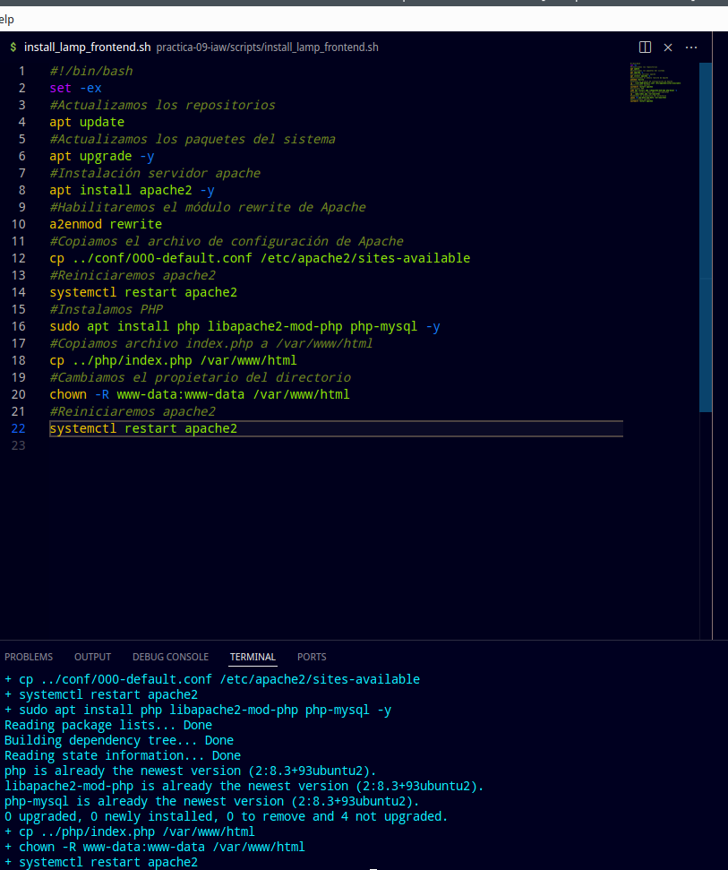
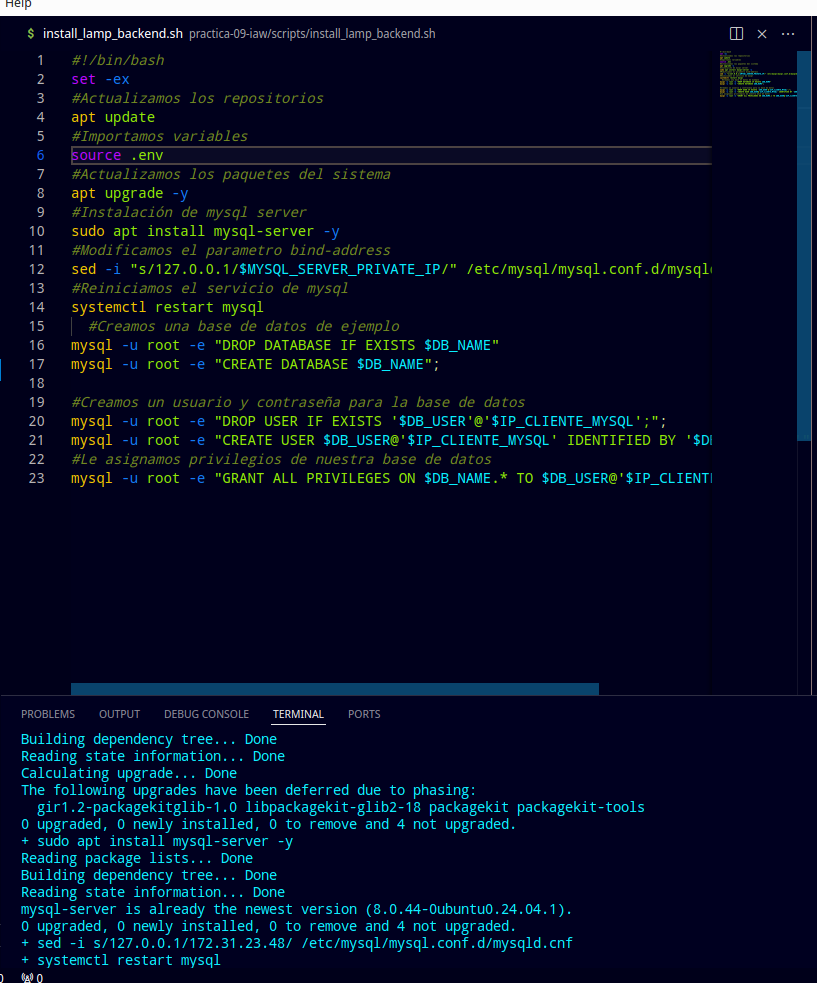

# practica-09-iaw
# Modificamos y ejecutamos el archivo install_lamp_frontend.sh
## #!/bin/bash
set -ex
## Actualizamos los repositorios
apt update
## Actualizamos los paquetes del sistema
apt upgrade -y
## Instalación servidor apache
apt install apache2 -y
## Habilitaremos el módulo rewrite de Apache
a2enmod rewrite
## Copiamos el archivo de configuración de Apache
cp ../conf/000-default.conf /etc/apache2/sites-available
## Reiniciaremos apache2
systemctl restart apache2
## Instalamos PHP
sudo apt install php libapache2-mod-php php-mysql -y
## Copiamos archivo index.php a /var/www/html
cp ../php/index.php /var/www/html
## Cambiamos el propietario del directorio
chown -R www-data:www-data /var/www/html
## Reiniciaremos apache2
systemctl restart apache2
# Modificamos y ejecutamos el archivo install_lamp_backend.sh
## #!/bin/bash
set -ex
## Actualizamos los repositorios
apt update
## Importamos variables
source .env
## Actualizamos los paquetes del sistema
apt upgrade -y
## Instalación de mysql server
sudo apt install mysql-server -y
## Modificamos el parametro bind-address
sed -i "s/127.0.0.1/$MYSQL_SERVER_PRIVATE_IP/" /etc/mysql/mysql.conf.d/mysqld.cnf
## Reiniciamos el servicio de mysql
systemctl restart mysql
## Creamos una base de datos de ejemplo
mysql -u root -e "DROP DATABASE IF EXISTS $DB_NAME"
mysql -u root -e "CREATE DATABASE $DB_NAME";
## Creamos un usuario y contraseña para la base de datos
mysql -u root -e "DROP USER IF EXISTS '$DB_USER'@'$IP_CLIENTE_MYSQL';";
mysql -u root -e "CREATE USER $DB_USER@'$IP_CLIENTE_MYSQL' IDENTIFIED BY '$DB_PASSWORD'";
## Le asignamos privilegios de nuestra base de datos
mysql -u root -e "GRANT ALL PRIVILEGES ON $DB_NAME.* TO $DB_USER@'$IP_CLIENTE_MYSQL'";
# Modificamos y ejecutamos el archivo deploy_wordpress_wpcli.sh
## #!/bin/bash
set -ex
## Importamos las variables de entorno 
source .env
## Eliminamos descargas previas de WP-CLI
 rm -f /tmp/wp-cli.phar
## Descargamos WP-CLI
 wget https://raw.githubusercontent.com/wp-cli/builds/gh-pages/phar/wp-cli.phar -P /tmp
## Le asignamos permisos de ejecución
 chmod +x /tmp/wp-cli.phar
## Movemos wp-cli.phar a /usr/local/bin/wp
 mv /tmp/wp-cli.phar /usr/local/bin/wp
## Borramos instalaciones previas de wordpress
 rm -rf /var/www/html/*
## Instalamos wp core
wp core download \
  --locale=es_ES \
  --path=/var/www/html \
  --allow-root
## Creamos archivo wp_config
wp config create \
  --dbname=$DB_NAME \
  --dbuser=$DB_USER \
  --dbpass=$DB_PASSWORD \
  --dbhost=$DB_HOST \
  --path=/var/www/html \
  --allow-root
## Instalamos wordpress
  wp core install \
  --url=wordpressiaw6.myddns.me \
  --title=$WORDPRESS_TITLE \
  --admin_user=$WORDPRESS_ADMIN_USER \
  --admin_password=$WORDPRESS_ADMIN_PASSWORD \
  --admin_email=$WORDPRESS_ADMIN_EMAIL \
  --path=/var/www/html \
  --allow-root  
## Configuramos los enlaces permanentes
wp rewrite structure '/%postname%/' \
  --path=/var/www/html \
  --allow-root
## Instalar plugin
wp plugin install wps-hide-login --activate \
   --path=/var/www/html \
    --allow-root
## Configuramos la url personalizada para el login
wp option update whl_page $URL_HIDE_LOGIN --path=/var/www/html --allow-root
## Instalamos un tema
wp theme install mindscape --activate \
--path=/var/www/html \
--allow-root
## Configuramos una url personalizada para la pagina de login
wp option update whl_page $URL_HIDE_LOGIN --path=/var/www/html --allow-root
cp ../htaccess/.htaccess /var/www/html
## Modificamos el propietario y el grupo de /var/www/html a www-data
chown -R www-data:www-data /var/www/html

